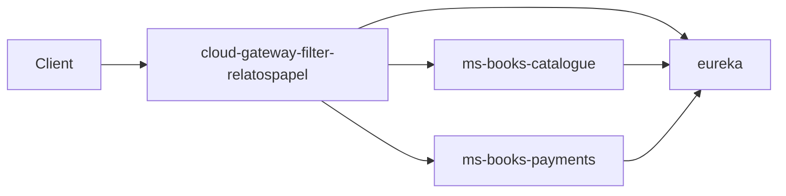

# Relatos de Papel – Backend (Microservicios)

Backend basado en **microservicios con Spring Boot + Spring Cloud**, registrado en **Eureka** y expuesto a través de un **API Gateway**. Incluye documentación **OpenAPI/Swagger** y endpoints listos para probarse con Postman.

> ⚠️ Todos los microservicios están dentro de la carpeta `lab2_e20/` (workspace principal del proyecto).

## Arquitectura (visión general)

- **Eureka**: Service discovery (registro de instancias).
- **Gateway**: punto único de entrada, enrutamiento por path y filtros custom.
- **Microservicios**: Catálogo (libros) y Pagos/Compras.



## Estructura del repositorio

- **`lab2_e20/`**: workspace con todos los módulos Maven (microservicios).
    - **`lab2_e20/eureka/`**: servidor Eureka (UI para ver microservicios registrados).
    - **`lab2_e20/cloud-gateway-filter-relatospapel/`**: API Gateway (Spring Cloud Gateway + filtros custom).
    - **`lab2_e20/ms-books-catalogue/`**: microservicio catálogo de libros (CRUD + búsqueda/paginación + Swagger).
    - **`lab2_e20/ms-books-payments/`**: microservicio pagos/compras (valida contra catálogo + persistencia + Swagger).

## Requisitos

- **Java JDK 25**
- **Apache Maven** (recomendado **3.9+**)
- IDE recomendado: **IntelliJ IDEA Ultimate**

Verificación rápida:

```bash
java -version
javac -version
mvn -v
```

## Importar microservicios como módulos Maven (IntelliJ)

Para cada carpeta dentro de `lab2_e20/`:

1. File → New → Module from Existing Sources…
2. Selecciona la carpeta del servicio
3. Importa como Maven
4. Finaliza

## Orden recomendado de arranque (local)

1. **Eureka**
2. **Gateway**
3. **Microservicios**: `ms-books-catalogue` y `ms-books-payments`

Cada servicio se puede ejecutar desde su carpeta con:

```bash
mvn spring-boot:run
```

## URLs útiles (local)

### Eureka (registro de servicios)

- **Eureka UI**: `http://localhost:8761`
- **Endpoint de registro (referencia)**: `http://localhost:8761/eureka`

### Gateway (punto único de entrada)

- **Base URL**: `http://localhost:8762`

### Documentacion con Swagger / OpenAPI

- Catálogo: `http://localhost:8088/swagger-ui.html`
- Payments: `http://localhost:8732/swagger-ui.html`

## Cómo consumir los microservicios a través del Gateway

Este Gateway usa una convención: **todas las peticiones “de negocio” entran como `POST`** y el método real (`GET`, `POST`, `PUT`, `PATCH`, `DELETE`) se define con `targetMethod` en el body.

Ejemplo: **listar libros** a través del Gateway:

```bash
curl -X POST "http://localhost:8762/ms-books-catalogue/books?page=0&size=10" \
  -H "Content-Type: application/json" \
  -d '{"targetMethod":"GET"}'
```

Ejemplo: **listar compras** (payments):

```bash
curl -X POST "http://localhost:8762/ms-books-payments/payments" \
  -H "Content-Type: application/json" \
  -d '{"targetMethod":"GET"}'
```

Ejemplo: **crear un libro**:

```bash
curl -X POST "http://localhost:8762/ms-books-catalogue/books" \
  -H "Content-Type: application/json" \
  -d '{
    "targetMethod":"POST",
    "body":{
      "title":"Cien años de soledad",
      "author":"Gabriel García Márquez",
      "publicationDate":"1967-05-30",
      "category":"Ficción",
      "codIsbn":"978-84-376-0494-7",
      "rate":5,
      "visible":true
    }
  }'
```

> Nota: Swagger/OpenAPI **no** usa esta convención; Swagger necesita `GET` para `/v3/api-docs` y recursos de `/swagger-ui`, y el Gateway ya permite esas rutas.

## Postman

- Colección / workspace (según README original): `https://orange-meadow-504725.postman.co/workspace/holamundo~e91d74f8-f3b2-47d7-b325-8ac44c6cbc96/request/17321329-1d7022bb-2db6-4e94-bc50-7f6848acda9a?action=share&creator=17321329&ctx=documentation`
